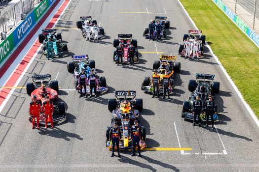

\doublespacing

```{r setup, include=FALSE}
knitr::opts_chunk$set(echo = FALSE, warning = FALSE)
library(tidyverse)
library(tinytex)
lap_times <- read_csv("Python/data.csv", show_col_types = FALSE)
```

**Introduction**

The 2022 Formula One season marked a significant change in technical regulations that aimed to improve the ability of cars to follow each other more closely. Alongside these rule changes, the season also witnessed the resurgence of a long-standing rival and the decline of a previously dominant team. In the opening rounds, Max Verstappen and Charles Leclerc were leading contenders for the driver's championship. However, Verstappen and Red Bull became dominant over the year, eventually clinching both titles. Heading into the 2023 season, Red Bull were considered the favorite, while Ferrari and Mercedes were expected to catch up. The first two races showed Aston Martin's impressive pace, while Red Bull maintained their momentum, making the fight for second place a three-way battle. This analysis focuses on each team's race pace and puts different drivers in the top-four teams drivers in a head-to-head every Grand Prix.

\vspace{1cm}

```{r, fig.align = "center", echo = FALSE}

```

\clearpage

**Bahrain Grand Prix**

```{r}
bahrain <- lap_times %>% filter(grand_prix == "Bahrain")
```

```{r, fig.align = "center", fig.height = 3, fig.width = 6}
bahrain %>% filter(tyres %in% c("soft", "medium", "hard")) %>%
  group_by(team) %>% ggplot(aes(x = team, y = time, fill = team)) +
  geom_boxplot(outlier.size = 0.75, outlier.shape = 15, show.legend = FALSE) +
  coord_flip() + labs(x = "Constructor", y = "Lap Time (s)") +
  scale_y_continuous(limit = c(96, 102))
```

```{r}
bahrain %>% filter(tyres %in% c("soft", "medium", "hard")) %>% 
  group_by(team) %>% summarise(median = round(median(time), 3), 
                               delta = round(median(time) - 97.501, 3)) %>% tibble()
```

```{r, fig.align = "center", fig.height = 3, fig.width = 6}
bahrain %>% group_by(lap) %>% summarise(median = median(time)) %>% 
  ggplot(aes(x = lap, y = median)) + geom_line(lwd = 0.75) + 
  scale_y_continuous(limit = c(96, 99)) + scale_x_continuous(limit = c(35, 57)) +
  geom_smooth(method = lm, se = FALSE, color = "maroon")
```

```{r}
bhr_df <- bahrain %>% group_by(lap) %>% filter(lap >= 35 & time <= 98) %>%
  summarise(median = median(time))

summary(lm(bhr_df$median ~ bhr_df$lap))$coefficients
```

\clearpage

**Saudi Arabian Grand Prix:**

```{r}
saudi <- lap_times %>% filter(grand_prix == "Saudi Arabia")
```

```{r, fig.align = "center", fig.height = 3, fig.width = 6}
saudi %>% filter(tyres %in% c("soft", "medium", "hard")) %>% 
  group_by(team) %>% ggplot(aes(x = team, y = time, fill = team)) +
  geom_boxplot(outlier.size = 0.75, outlier.shape = 15, show.legend = FALSE) +
  coord_flip() + labs(x = "Constructor", y = "Lap Time (s)") +
  scale_y_continuous(limit = c(91, 103))
```

```{r}
saudi %>% filter(tyres %in% c("soft", "medium", "hard")) %>% 
  group_by(team) %>% summarise(median = round(median(time), 3), 
                               delta = round(median(time) - 93.214, 3)) %>% tibble()
```

```{r, fig.align = "center", fig.height = 3, fig.width = 6}
saudi %>% group_by(lap) %>% summarise(median = median(time)) %>% 
  ggplot(aes(x = lap, y = median)) + geom_line(lwd = 0.75) + 
  scale_y_continuous(limit = c(92, 96)) + scale_x_continuous(limit = c(22, 50)) +
  geom_smooth(method = lm, se = FALSE, color = "forestgreen")
```

```{r}
sau_df <- saudi %>% group_by(lap) %>% filter(lap >= 22) %>% 
  summarise(median = median(time))

summary(lm(sau_df$median ~ sau_df$lap))$coefficients
```

\clearpage

**Australian Grand Prix:**

```{r}
australia <- lap_times %>% filter(grand_prix == "Australia")
```

```{r, fig.align = "center", fig.height = 3, fig.width = 6}
australia %>% filter(tyres %in% c("soft", "medium", "hard"), 
                     driver != "RUS") %>% 
  group_by(team) %>% ggplot(aes(x = team, y = time, fill = team)) +
  geom_boxplot(outlier.size = 0.75, outlier.shape = 15, show.legend = FALSE) +
  coord_flip() + labs(x = "Constructor", y = "Lap Time (s)") + 
  scale_y_continuous(limit = c(79, 94))
```

```{r}
australia %>% filter(tyres %in% c("soft", "medium", "hard") & 
                       driver != "RUS") %>% 
  group_by(team) %>% summarise(median = round(median(time), 3), 
                               delta = round(median(time) - 81.921, 3)) %>% tibble()
```

```{r, fig.align = "center", fig.height = 3, fig.width = 6}
australia %>% group_by(lap) %>% summarise(median = median(time)) %>% 
  ggplot(aes(x = lap, y = median)) + geom_line(lwd = 0.75) + 
  scale_y_continuous(limit = c(80, 84)) + scale_x_continuous(limit = c(20, 53)) +
  geom_smooth(method = lm, se = FALSE, color = "navy")
```

```{r}
aus_df <- australia %>% group_by(lap) %>% filter(lap >= 20 & lap <= 53) %>%
  summarise(median = median(time))

summary(lm(aus_df$median ~ aus_df$lap))$coefficients
```